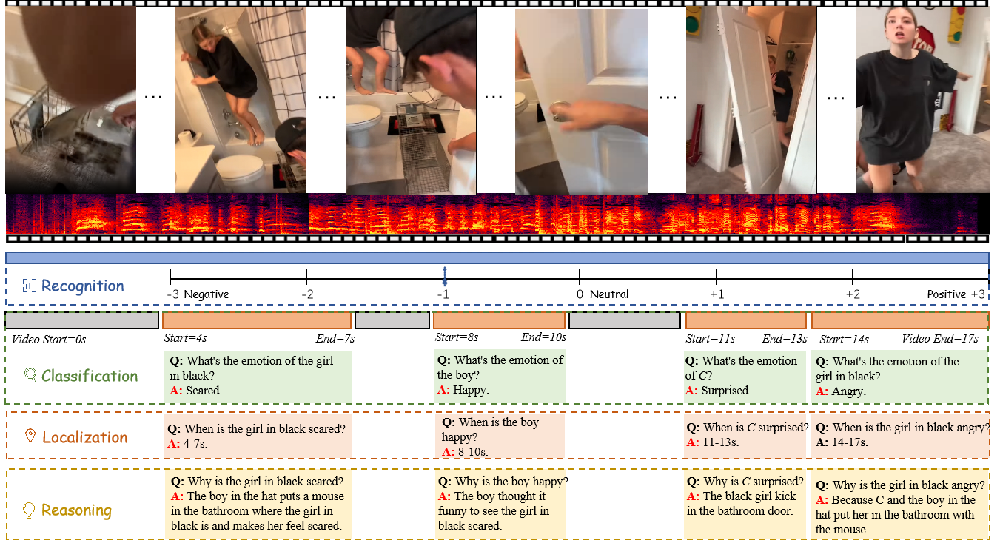

# $E^3$: Exploring Embodied Emotion Through A Large-Scale Egocentric Video Dataset
This repo holds the implementation code and [dataset](dataset/README.MD) <br>


## :rocket: Demo
**1. Clone the repository** <br>

```bash
git clone https://github.com/Exploring-Embodied-Emotion-official/E3.git
cd E3/MiniGPT4-video
```

**2. Set up the environment** <br>

```bash
conda env create -f environment.yml
```
## :fire: Training
set the cfg-path in the script to `train_configs/224_v2_llama2_video_stage_3.yaml` <br>
set the model name here `minigpt4/configs/datasets/video_chatgpt/default.yaml` to llama2<br>

## :zap: Evaluation

### Run evaluation script

Set the each evaluation script parameters to include the path to the checkpoints, the dataset name and whether to use subtitles/speech or not <br>

```shell
CUDA_VISIBLE_DEVICES=3 python eval_video.py \
--dataset "ego-sentiment" \
--batch_size 4 \
--name "llama2_best" \
--ckpt <path-to-weights> \
--cfg-path "test_configs/llama2_test_config.yaml" \
--wav_base <path-to-audio> \
--result_path <result-json-path> \
--ann_path <path-to-test-json> \
--add_subtitles \
--need_speech
```

For evaluation on all 4 criteria, you can use: 

```bash
# Llama2
bash jobs_video/eval/llama2_evaluation.sh
```

Then Use GPT3.5 turbo to compare the predictions with the ground truth and generate the accuracy and scores <br>
Set these variables in both evaluate_benchmark.sh and evaluate_zeroshot.sh <br>

```bash
PRED="path_to_predictions"
OUTPUT_DIR="path_to_output_dir"
API_KEY="openAI_key"
NUM_TASKS=128
```

Then run the following script <br>

```bash
bash test_benchmark/quantitative_evaluation/evaluate_benchmark.sh
```

## 🎈Citation
If you find our work valuable, we would appreciate your citation: 
```text
@article{feng20243,
  title={$ E\^{} 3$: Exploring Embodied Emotion Through A Large-Scale Egocentric Video Dataset},
  author={Feng, Yueying and Han, WenKang and Jin, Tao and Zhao, Zhou and Wu, Fei and Yao, Chang and Chen, Jingyuan and others},
  journal={Advances in Neural Information Processing Systems},
  volume={37},
  pages={118182--118197},
  year={2024}
}

```


## Acknowledgements

[MiniGPT4-video](https://github.com/Vision-CAIR/MiniGPT4-video) <br>

## License

This repository is under [Attribution-NonCommercial-ShareAlike 4.0 International](LICENSE).
Many codes are based on [MiniGPT4-video](https://github.com/Vision-CAIR/MiniGPT4-video).

